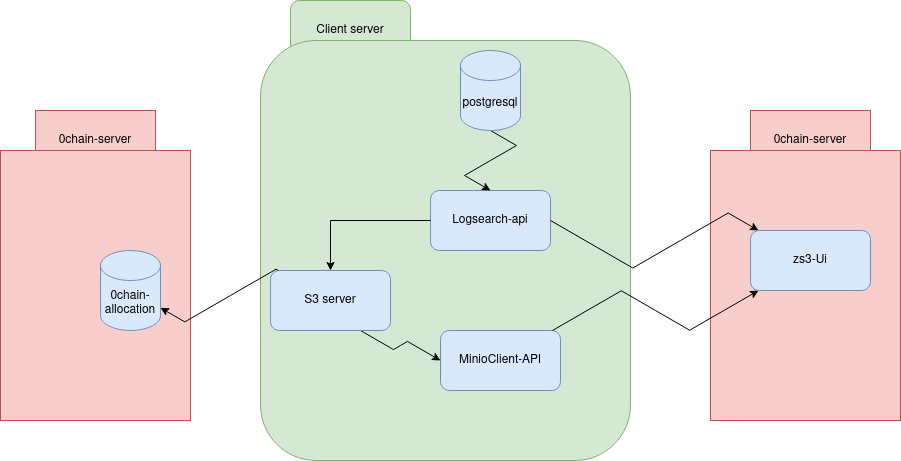

# zs3server - a no-code decentralized storage server

zs3server provides a no-code s3-compatible decentralized storage server on Züs allocation using a minio-gateway interface.

- [Züs Overview](#züs-overview)
- [Architecture](#architecture)
- [Building zs3 server](#building-zs3-server)
- [Running zs3 server](#running-zs3-server)
- [Test MiniO client](#test-minio-client)
- [Configure Minio client](#configure-minio-client)

## Züs Overview

[Züs](https://zus.network/) is a high-performance cloud on a fast blockchain offering privacy and configurable uptime. It is an alternative to traditional cloud S3 and has shown better performance on a test network due to its parallel data architecture. The technology uses erasure code to distribute the data between data and parity servers. Züs storage is configurable to provide flexibility for IT managers to design for desired security and uptime, and can design a hybrid or a multi-cloud architecture with a few clicks using [Blimp's](https://blimp.software/) workflow, and can change redundancy and providers on the fly.

For instance, the user can start with 10 data and 5 parity providers and select where they are located globally, and later decide to add a provider on-the-fly to increase resilience, performance, or switch to a lower cost provider.

Users can also add their own servers to the network to operate in a hybrid cloud architecture. Such flexibility allows the user to improve their regulatory, content distribution, and security requirements with a true multi-cloud architecture. Users can also construct a private cloud with all of their own servers rented across the globe to have a better content distribution, highly available network, higher performance, and lower cost.

[The QoS protocol](https://medium.com/0chain/qos-protocol-weekly-debrief-april-12-2023-44524924381f) is time-based where the blockchain challenges a provider on a file that the provider must respond within a certain time based on its size to pass. This forces the provider to have a good server and data center performance to earn rewards and income.

The [privacy protocol](https://zus.network/build) from Züs is unique where a user can easily share their encrypted data with their business partners, friends, and family through a proxy key sharing protocol, where the key is given to the providers, and they re-encrypt the data using the proxy key so that only the recipient can decrypt it with their private key.

Züs has ecosystem apps to encourage traditional storage consumption such as [Blimp](https://blimp.software/), a S3 server and cloud migration platform, and [Vult](https://vult.network/), a personal cloud app to store encrypted data and share privately with friends and family, and [Chalk](https://chalk.software/), a zero upfront cost permanent storage solution for NFT artists.

Other apps are [Bolt](https://bolt.holdings/), a wallet that is very secure with air-gapped 2FA split-key protocol to prevent hacks from compromising your digital assets, and it enables you to stake and earn from the storage providers; [Atlus](https://atlus.cloud/), a blockchain explorer and [Chimney](https://demo.chimney.software/), which allows anyone to join the network and earn using their server or by just renting one, with no prior knowledge required.

## Architecture



There are three main components that will be installed in the customer server.

1. ZS3Server is the main component that will communicate directly with Züs storage.

2. [LogSearch](/logsearchapi/README.md) API is the log component that will store the audit log from the S3 server and it will be consumed using ZS3 API

3. [MinioClient](/client-api/README.md) is the component that will communicate directly to the zs3server and it is protected using access and secret key.

## Building zs3-server

Prerequisites to run MinIO ZCN gateway:

- [A wallet.json created using zwalletcli](https://github.com/0chain/zwalletcli#creating-and-restoring-wallets)
- [Config.yaml](https://github.com/0chain/zboxcli/blob/staging/network/config.yaml)
- [An allocation.txt created using zboxcli](https://github.com/0chain/zboxcli/tree/staging#create-new-allocation).
- [A zs3server.json option file to configure encryption and compress options](https://github.com/0chain/zs3server/tree/staging/zs3server.json)

```
git clone git@github.com:0chain/zs3server.git
cd zs3server
go mod tidy
go build .
export MINIO_ROOT_USER=someminiouser
export MINIO_ROOT_PASSWORD=someminiopassword
./minio gateway zcn --configDir /path/to/config/dir
Note: allocation and configDir both are optional. By default configDir takes ~/.zcn as configDir and if allocation is not provided in command then it will look for allocation.txt file in configDir directory.
```

> If you want to debug on local you might want to build with `-gcflags="all=-N -l"` flag to view all the objects during debugging.

## Running zs3-server

1. To build and run the minio server component you need to install [docker](https://www.docker.com/products/docker-desktop/).

2. Run the docker-compose command inside the zs3server directory./

```
docker-compose -f environment/docker-compose.yaml up -d
```

3. Make sure allocation.txt file exist in the default folder `~/.zcn`

4. Now you can interact with the clint API follow this [doc](/client-api/README.md)

5. You can also interact with the logsearch API by following this [doc](/logsearchapi/README.md)

## Test using AWS Client `aws`

### Installation

Install from here: https://aws.amazon.com/cli/

### Configuration

Fetch the access key and secret from your deployed zs3server. To configure `aws cli`, type `aws configure` and
specify the zs3server key information like below:

```
aws configure
AWS Access Key ID [None]: miniouser
AWS Secret Access Key [None]: miniopassword
Default region name [None]: us-east-1
Default output format [None]: ENTER
```

Additionally enable AWS Signature Version ‘4’ for zs3server.

`aws configure set default.s3.signature_version s3v4`

### Examples

#### To list your buckets

```
aws --endpoint-url https://localhost:9000 s3 ls
2016-03-27 02:06:30 deebucket
2016-03-28 21:53:49 guestbucket
2016-03-29 13:34:34 mbtest
2016-03-26 22:01:36 mybucket
2016-03-26 15:37:02 testbucket
```

#### To list contents inside bucket

```
aws --endpoint-url https://localhost:9000 s3 ls s3://mybucket
2016-03-30 00:26:53      69297 argparse-1.2.1.tar.gz
2016-03-30 00:35:37      67250 simplejson-3.3.0.tar.gz
```

#### To make a bucket

```
aws --endpoint-url https://localhost:9000 s3 mb s3://mybucket
make_bucket: s3://mybucket/
```

#### To add an object to a bucket

```
aws --endpoint-url https://localhost:9000 s3 cp simplejson-3.3.0.tar.gz s3://mybucket
upload: ./simplejson-3.3.0.tar.gz to s3://mybucket/simplejson-3.3.0.tar.gz
```

#### To delete an object from a bucket

```
aws --endpoint-url https://localhost:9000 s3 rm s3://mybucket/argparse-1.2.1.tar.gz
delete: s3://mybucket/argparse-1.2.1.tar.gz
```

#### To remove a bucket

```
aws --endpoint-url https://localhost:9000 s3 rb s3://mybucket
remove_bucket: s3://mybucket/
```

## Test using MinIO Client `mc`

`mc` provides a modern alternative to UNIX commands such as ls, cat, cp, mirror, diff etc. It supports filesystems
and Amazon S3 compatible cloud storage services.

### Installation

Install from here for your os: https://min.io/docs/minio/macos/index.html

## Configure MinIO Client

```
mc alias set zcn http://localhost:9000 miniouser miniopassword --api S3v2
```

### Examples

#### To list your buckets

```
mc ls zcn/
2016-03-27 02:06:30 deebucket
2016-03-28 21:53:49 guestbucket
2016-03-29 13:34:34 mbtest
2016-03-26 22:01:36 mybucket
2016-03-26 15:37:02 testbucket
```

#### To list contents inside bucket

```
mc ls zcn/mybucket
2016-03-30 00:26:53      69297 argparse-1.2.1.tar.gz
2016-03-30 00:35:37      67250 simplejson-3.3.0.tar.gz
```

#### To make a bucket

```
mc mb zcn/mybucket
make_bucket: zcn/mybucket
```

#### To add an object to a bucket

```
mc cp simplejson-3.3.0.tar.gz zcn/mybucket
upload: ./simplejson-3.3.0.tar.gz to zcn/mybucket/simplejson-3.3.0.tar.gz
```

#### To delete an object from a bucket

```
mc rm zcn/mybucket/argparse-1.2.1.tar.gz
delete: zcn/mybucket/argparse-1.2.1.tar.gz
```

#### To remove a bucket

```
mc rb zcn/mybucket
remove_bucket: zcn/mybucket/
```

Check `mc --help` for the exhaustive list of cmds available.

## Test using Postman Using REST APIs

- Add the following authorization settings
  
- The `AccessKey` would be the MINIO_ROOT_USER which you set earlier during zs3server deployment and `SecretKey` would be the MINIO_ROOT_PASSWORD.
- If you do not want to share the MINIO_ROOT_USER and MINIO_ROOT_PASSWORD, you can also create a user from minio console and share their access key and secret instead.
- Use the REST APIs to interact with the server.
- Postman collection for the same is provided below:
  [Postman Collection](./assets/Zs3ServerCollection.postman_collection.json)

## Replication

To setup replication, you need to have two zs3servers. For running two zs3servers on the same machine, you will need to copy the contents of .zcn folder to .zcn2 folder and change allocation.txt and zs3server.json accordingly. For changes in docker-compose.yaml, you can refer to the following example:
[docker-compose.yaml](https://github.com/0chain/zs3server/tree/staging/environment/docker-compose-dev2.yaml)

- Configure both the zs3servers using minio client.

```
mc alias set primary http://<HOST_IP>:9000 miniouser miniopassword --api S3v2
mc alias set secondary http://<HOST_IP>:9002 miniouser miniopassword --api S3v2
```

- Set up replication using the following command, for more details refer to [mc mirror](https://min.io/docs/minio/linux/reference/minio-mc/mc-mirror.html) command.

```
./mc mirror primary/<BUCKET_PREFIX>/ secondary/<BUCKET_PREFIX>/ --remove --watch
```

## Disaster Recovery

Disaster recovery is process of replicating data from secondary to primary in case of primary failure. To set up disaster recovery, you need to have replication setup between primary and secondary zs3servers. In case of primary failure, you can use the following command to sync data from secondary to primary.

```
./mc mirror secondary/<BUCKET_NAME>/ primary/<BUCKET_NAME/ --summary
```

## Encryption and Compression

To enable encryption and compression, you need to provide the encryption and compression options in the zs3server.json file under .zcn folder. For example:

```
{
  "encrypt": true,
  "compress": true,
}
```

## Batch Upload settings

The server will batch upload requests for objects which are uploaded using put api and has a defined content length. Max batch size refers to number of objects max objects to upload in one batch, this number should be similar to concurrency or thread set in client or expected number of requests per seconds, batch wait time will wait for this much amount of time before finalizing a batch and uploading it, number of batch workers will determine how many batches can we upload concurrently. For example:

```
{
  "max_batch_size": 25, // set same as concurrency set via rclone or client
  "batch_wait_time": 500, // can increase the wait time if the time between requests is more
  "batch_workers": 5 // number of workers, can be increased based on the number of requests
}
```

If you are using compression, we recommeng using our minio client
[Minio Client](https://github.com/0chain/mc)
