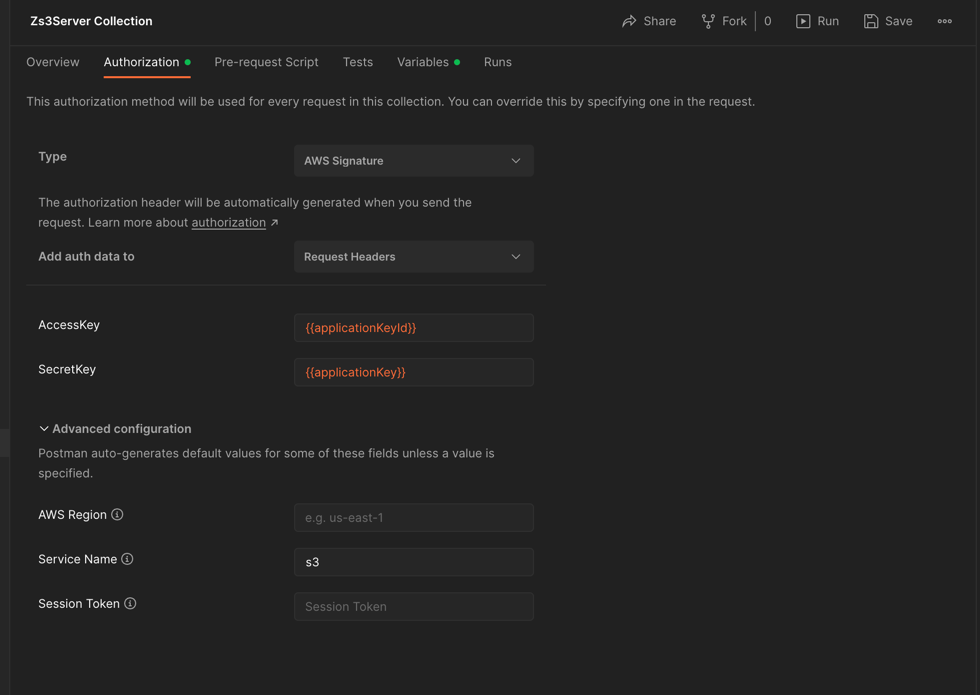

# Introduction
This module provides s3-compatible API to 0chain allocation using minio-gateway Interface.
User can set their access-key and secret-key before running zs3Server. So basically, zs3server is an http server that provides s3 compatible api so that clients that are already s3 compatible can easily communicates with 0chain allocationcan. Its just a plug and play.

# Architecture 


There are three main components that will be installed in the customer server. 

1. ZS3Server is the main component which will communicate directly with 0chain allocation 

2. [LogSereach](/logsearchapi/README.md) API is the log component which will store the audit log from S3 server and It will be consumed using ZS3 API

3. [MinioClient](/client-api/README.md) is the component that will communicate directly to the zs3server and it is protected using access and secret key. 


# Run zs3-server
As a prerequisite to run MinIO ZCN gateway, you need 0chain credentials; wallet.json, config.yaml and allocation.txt.

## Build Binary
```
git clone git@github.com:0chain/zs3server.git
cd zs3server
go mod tidy
go build .
export MINIO_ROOT_USER=someminiouser
export MINIO_ROOT_PASSWORD=someminiopassword
./minio gateway zcn --configDir /path/to/config/dir
Note: allocation and configDir both are optional. By default configDir takes ~/.zcn as configDir and if allocation is not provided in command then it will look for allocation.txt file in configDir directory.
```

> If you want to debug on local you might want to build with `-gcflags="all=-N -l"` flag to view all the objects during debugging.

## Run using docker 

To build and run minio sevrer component in any machine you will need first to install docker and docker-compose 

1. Make sure docker and docker-compose in your machine

2. Make sure you have the allocation ready in the default folder ``~/.zcn``

3. Run docker-compose command like the following

```
docker-compose up -d
```

4. Now you can interact with the clint API follow this [doc](/client-api/README.md)

5. You can also interact with the logsearch API by following this [doc](/logsearchapi/README.md)


## Test using AWS Client `aws`
### Installation
Install from here: https://aws.amazon.com/cli/

### Configuration
Fetch the access key and secret from your deployed the zs3server. To configure `AWS CLI`, type `aws configure` and 
specify the zs3server key information like below:
```
aws configure
AWS Access Key ID [None]: miniouser
AWS Secret Access Key [None]: miniopassword
Default region name [None]: us-east-1
Default output format [None]: ENTER
```

Additionally enable AWS Signature Version ‘4’ for zs3server.

`aws configure set default.s3.signature_version s3v4`

### Examples
#### To list your buckets
```
aws --endpoint-url https://localhost:9000 s3 ls
2016-03-27 02:06:30 deebucket
2016-03-28 21:53:49 guestbucket
2016-03-29 13:34:34 mbtest
2016-03-26 22:01:36 mybucket
2016-03-26 15:37:02 testbucket
```

#### To list contents inside bucket
```
aws --endpoint-url https://localhost:9000 s3 ls s3://mybucket
2016-03-30 00:26:53      69297 argparse-1.2.1.tar.gz
2016-03-30 00:35:37      67250 simplejson-3.3.0.tar.gz
```

#### To make a bucket
```
aws --endpoint-url https://localhost:9000 s3 mb s3://mybucket
make_bucket: s3://mybucket/
```

#### To add an object to a bucket
```
aws --endpoint-url https://localhost:9000 s3 cp simplejson-3.3.0.tar.gz s3://mybucket
upload: ./simplejson-3.3.0.tar.gz to s3://mybucket/simplejson-3.3.0.tar.gz
```

#### To delete an object from a bucket
```
aws --endpoint-url https://localhost:9000 s3 rm s3://mybucket/argparse-1.2.1.tar.gz
delete: s3://mybucket/argparse-1.2.1.tar.gz
```

#### To remove a bucket
```
aws --endpoint-url https://localhost:9000 s3 rb s3://mybucket
remove_bucket: s3://mybucket/
```


## Test using MinIO Client `mc`
`mc` provides a modern alternative to UNIX commands such as ls, cat, cp, mirror, diff etc. It supports filesystems 
and Amazon S3 compatible cloud storage services.

### Installation
Install from here for your os: https://min.io/docs/minio/macos/index.html

### Configure `mc`
```
mc config host add zcn http://localhost:9000 miniouser miniopassword
```

### Examples
#### To list your buckets
```
mc ls zcn/
2016-03-27 02:06:30 deebucket
2016-03-28 21:53:49 guestbucket
2016-03-29 13:34:34 mbtest
2016-03-26 22:01:36 mybucket
2016-03-26 15:37:02 testbucket
```

#### To list contents inside bucket
```
mc ls zcn/mybucket
2016-03-30 00:26:53      69297 argparse-1.2.1.tar.gz
2016-03-30 00:35:37      67250 simplejson-3.3.0.tar.gz
```

#### To make a bucket
```
mc mb zcn/mybucket
make_bucket: zcn/mybucket
```

#### To add an object to a bucket
```
mc cp simplejson-3.3.0.tar.gz zcn/mybucket
upload: ./simplejson-3.3.0.tar.gz to zcn/mybucket/simplejson-3.3.0.tar.gz
```

#### To delete an object from a bucket
```
mc rm zcn/mybucket/argparse-1.2.1.tar.gz
delete: zcn/mybucket/argparse-1.2.1.tar.gz
```

#### To remove a bucket
```
mc rb zcn/mybucket
remove_bucket: zcn/mybucket/
```

Check `mc --help` for the exhaustive list of cmds available.


## Test using Postman Using REST APIs
- Add the following authorization settings

- The `AccessKey` would be the MINIO_ROOT_USER which you set earlier during zs3server deployment and `SecretKey` would be the MINIO_ROOT_PASSWORD.
- If you do not want to share the MINIO_ROOT_USER and MINIO_ROOT_PASSWORD, you can also create a user from minio console and share their access key and secret instead.
- Use the REST APIs to interact with the server. 
- Postman collection for the same is provided below:
[Postman Collection](./assets/Zs3ServerCollection.postman_collection.json)